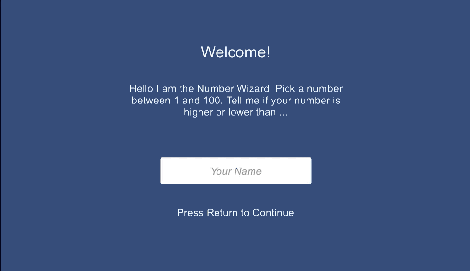

# 06home-NumberWizard-schiderf

### Project description: 
the Numberwizard tries to guess an imagined number between 1 and 100

### Development platform: 
MacOS, Unity2020, VisualStudio Code

### Target platform: 
WebGL 900x600

### Visuals: 

### Third party material: 
Template for 2DUnity Project

### Project state: 
100%

### Limitations: 

### Lessons Learned: 

Copyright by Schider Felix

